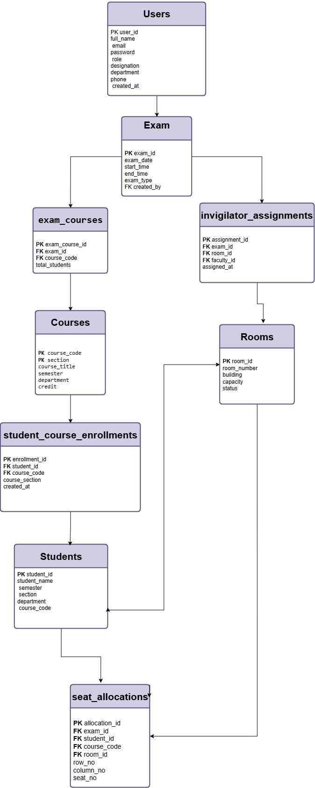
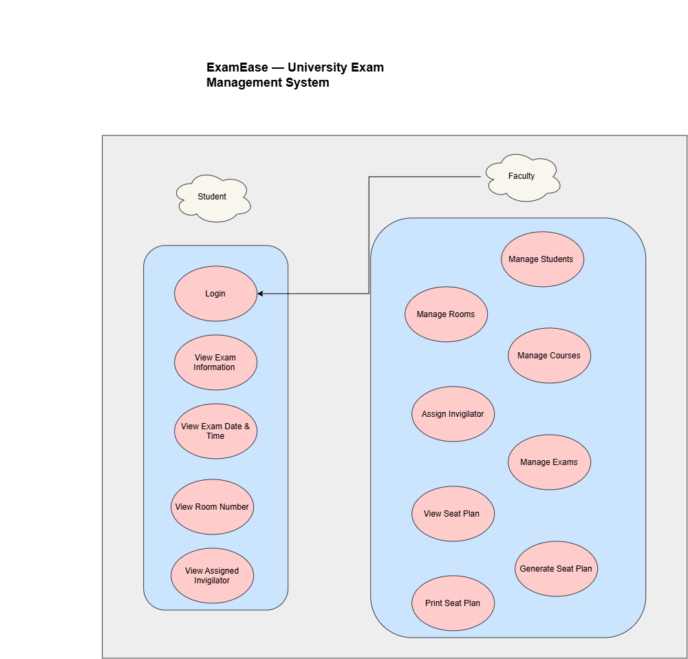

# ExamEase

## University Exam Management System

ExamEase is a web-based university examination management system designed to simplify and organize the management of students, faculty, courses, examinations, examination rooms, invigilator assignments, and student seat allocation.

## Project Overview

ExamEase provides a centralized platform for managing university examination activities. It helps authorized users manage student, faculty, course, room, and examination information and generates organized examination seat plans.

The system reduces manual work and helps improve the accuracy and efficiency of examination management.

## Objectives

* Digitize the university examination management process.
* Manage student and faculty information.
* Manage courses and course sections.
* Manage examination rooms and room capacities.
* Create and manage examination schedules.
* Assign courses to examinations.
* Assign faculty members as invigilators.
* Automatically allocate students to examination rooms and seats.
* Provide students with their examination information.
* Reduce manual errors in examination planning.

## Key Features

### Student Management

* Add and manage student information.
* Manage semester and section information.
* Manage student course enrollment.

### Faculty Management

* Add and manage faculty information.
* Assign faculty members as examination invigilators.

### Course Management

* Add and manage courses.
* Manage course code, title, section, semester, department, and credit.

### Room Management

* Add and manage examination rooms.
* Manage room capacity.
* Manage room availability.

### Examination Management

* Create and manage examinations.
* Set examination date and time.
* Associate courses with examinations.

### Invigilator Assignment

* Assign faculty members to examination rooms.
* Manage invigilator assignments for examinations.

### Automatic Seat Allocation

* Allocate students to available examination rooms.
* Consider room capacity during allocation.
* Generate organized seat plans.
* Store room, row, column, and seat information.

### Student Examination Information

Students can view their relevant examination information, including examination date, time, assigned room, and assigned invigilator.

## System Design

ExamEase follows a client-server architecture.

```text
User
  ↓
React Frontend
  ↓
REST API
  ↓
Node.js + Express Backend
  ↓
MySQL Database
```

The frontend provides the user interface, the backend handles application logic and REST APIs, and the MySQL database stores the system data.

## Technology Stack

| Technology      | Purpose                        |
| --------------- | ------------------------------ |
| React           | Frontend development           |
| Tailwind CSS    | User interface styling         |
| JavaScript      | Application development        |
| Node.js         | Backend runtime                |
| Express.js      | REST API and backend framework |
| MySQL           | Database management            |
| JWT             | Authentication                 |
| bcrypt/bcryptjs | Password hashing               |
| Git             | Version control                |
| GitHub          | Source code management         |

## Database Design

The database is named `examease`.

The system contains the following tables:

* `users`
* `students`
* `courses`
* `student_course_enrollments`
* `exams`
* `exam_courses`
* `rooms`
* `invigilator_assignments`
* `seat_allocations`

The complete database structure is available in `examease.sql`.

### Users

Stores user account and authentication information.

**Primary Key:** `user_id`

Important fields:

* `user_id`
* `full_name`
* `email`
* `password`
* `role`
* `designation`
* `department`
* `phone`
* `created_at`

### Students

Stores student academic information.

**Primary Key:** `student_id`

Important fields:

* `student_id`
* `student_name`
* `semester`
* `section`
* `department`
* `course_code`

### Courses

Stores course information.

**Primary Key:** `(course_code, section)`

Important fields:

* `course_code`
* `section`
* `course_title`
* `semester`
* `department`
* `credit`

### Student Course Enrollments

Stores the relationship between students and courses.

**Primary Key:** `enrollment_id`

Important fields:

* `enrollment_id`
* `student_id`
* `course_code`
* `course_section`
* `created_at`

### Exams

Stores examination schedules.

**Primary Key:** `exam_id`

Important fields:

* `exam_id`
* `exam_date`
* `start_time`
* `end_time`
* `exam_type`
* `created_by`

### Exam Courses

Associates courses with examinations.

**Primary Key:** `exam_course_id`

Important fields:

* `exam_course_id`
* `exam_id`
* `course_code`
* `total_students`

### Rooms

Stores examination room information.

**Primary Key:** `room_id`

Important fields:

* `room_id`
* `room_number`
* `building`
* `capacity`
* `status`

### Invigilator Assignments

Stores faculty assignments for examination rooms.

**Primary Key:** `assignment_id`

Important fields:

* `assignment_id`
* `exam_id`
* `room_id`
* `faculty_id`
* `assigned_at`

### Seat Allocations

Stores the generated student seating information.

**Primary Key:** `allocation_id`

Important fields:

* `allocation_id`
* `exam_id`
* `student_id`
* `course_code`
* `room_id`
* `row_no`
* `column_no`
* `seat_no`

## Database Relationships

The main relationships between the database entities are:

```text
Users ─────────────── Exams
  │                     │
  │                     │
  │                 Exam Courses
  │                     │
  │                     │
  │                   Courses
  │
  └──── Invigilator Assignments
              │
              ├── Exams
              ├── Rooms
              └── Users


Students ─── Student Course Enrollments ─── Courses
   │
   │
   └──────── Seat Allocations
                    │
                    ├── Exams
                    ├── Courses
                    └── Rooms
```

## ER Diagram



## Use-Case Diagram


## User Interface

ExamEase provides interfaces for:

* Login
* Dashboard
* Student Management
* Faculty Management
* Course Management
* Room Management
* Examination Management
* Invigilator Assignment
* Seat Plan
* Student Examination Information

## System Workflow

```text
Login
  ↓
Dashboard
  ↓
Manage Students
  ↓
Manage Courses
  ↓
Manage Faculty
  ↓
Manage Rooms
  ↓
Create Examination
  ↓
Add Courses to Examination
  ↓
Assign Invigilators
  ↓
Generate Seat Plan
  ↓
Review Seat Allocation
  ↓
View / Print Examination Information
```

## Seat Allocation Process

The seat allocation process works as follows:

1. Select an examination.
2. Identify the courses associated with the examination.
3. Identify the students taking the examination.
4. Select available examination rooms.
5. Check room capacity.
6. Allocate students to available rooms.
7. Assign row, column, and seat information.
8. Store the allocation in the database.
9. Display the generated seat plan.

## Authentication

ExamEase provides user authentication using the user accounts stored in the `users` table.

The system supports the following roles:

* Student
* Faculty

Passwords are securely hashed before being stored in the database.

## Project Structure

```text
ExamEase/
│
├── Frontend/
│   ├── public/
│   ├── src/
│   └── package.json
│
├── backend/
│   ├── config/
│   ├── controllers/
│   ├── middleware/
│   ├── routes/
│   ├── utils/
│   ├── server.js
│   └── package.json
│
├── database/
│   └── samples/
│
├── exam-allocator/
├── scripts/
├── examease.sql
├── package.json
├── package-lock.json
├── README.md
└── .gitignore
```

## Installation

### Prerequisites

* Node.js
* npm
* MySQL Server
* Git

### Clone the Repository

```bash
git clone https://github.com/sbkrittika/ExamEase.git
cd ExamEase
```

### Install Dependencies

```bash
npm install
npm install --prefix backend
npm install --prefix Frontend
```

### Database Setup

The database schema is provided in:

```text
examease.sql
```

The database name is:

```text
examease
```

The project also provides a database setup script:

```bash
npm run db:setup
```

### Environment Variables

Create a `.env` file in the backend directory with the required database and authentication configuration.

```env
DB_HOST=your_database_host
DB_USER=your_database_user
DB_PASSWORD=your_database_password
DB_NAME=examease
JWT_SECRET=your_jwt_secret
```

Do not upload sensitive credentials or `.env` files containing actual secrets to GitHub.

## Running the Application

Start the backend:

```bash
npm run backend
```

Start the frontend in another terminal:

```bash
npm run frontend
```

The frontend runs at:

```text
http://127.0.0.1:5173/
```

The backend API runs at:

```text
http://127.0.0.1:5000/
```

## Project Dataset

The final showcase version of ExamEase uses:

* 7th Semester
* 100 Students
* Sections 1–6
* CSE Department
* Finalized Semester-7 courses
* Configured examination rooms
* Configured faculty members


## Future Improvements

* Advanced examination timetable generation
* Examination conflict detection
* Improved seat allocation algorithms
* Automated email notifications
* SMS notifications
* Examination statistics and analytics
* Mobile application support
* Enhanced role-based access control

## Conclusion

ExamEase provides a centralized web-based solution for university examination management.

The system integrates student management, faculty management, course management, room management, examination management, invigilator assignment, and automatic seat allocation into a single platform.

By reducing manual examination management tasks, ExamEase aims to make the examination planning and management process more organized, efficient, and reliable.

## Repository

GitHub Repository:

https://github.com/sbkrittika/ExamEase
